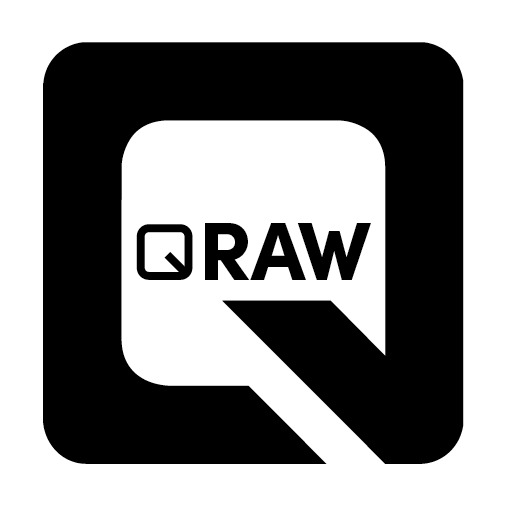

<p align="center">
  
</p>
# QRAW: Optimised VC-5/GPR For ARM

A RAW video encoder for ARM. It takes Bayer frames from a sensor and writes
`.gpr` files fast enough to keep up with a camera, on a Raspberry Pi 5, using
only the CPU.

QRAW started as the GoPro GPR SDK. GPR is built for stills, where one frame per
button press is plenty of time. Video is a different problem: you get about
20 ms per frame and you never get it back. Most of the work here was rewriting
the transform and entropy paths in NEON, and then rearranging everything around
the fact that a Pi 5 runs out of memory bandwidth long before it runs out of
CPU. The result is roughly 52% faster than a straightforward CPU port, and it
holds 4K in real time.

Output is ordinary GPR. Adobe Camera Raw opens it, `gpr_tools` decodes it, and
nothing downstream needs to know the files came from here. That holds for every
quality lever below, including the ones that change what gets stored.

This repository is the encoder and the benchmark that proves it. The CinePi
camera application that drives it lives in **cinepi-qraw-alpha**.

---

## What you get

**Ten quality modes**, m1 through m10, on one calibrated quantiser ladder. m1 is
the largest and best, m10 the smallest, and the low-pass band is never
quantised.

**Three quality levers** that sit on top of the ladder, independent of it and of
each other:

- **CAQ** (off / soft / medium / strong) spends fewer bits on the colour
  residual channels and, more gently, on GD, leaving the green mean alone.
- **Pixel Clean** widens the dead-zone to 125% of the half-step and zeroes ±1
  colour coefficients at level 1. Because the widened threshold also feeds the
  encoder's provable-zero skips, it makes the file smaller *and* the encode
  cheaper rather than trading one against the other.
- **Noise Clean** (off / soft / medium / strong, plus a strength scalar) does
  the same trick deeper, on selected level-1 bands. It is not a denoise pass and
  adds no second pass, no per-frame statistic and no state. Medium is the
  default at roughly 4% smaller with a small speed gain; strong reaches about 8%
  but starts pruning the green mean, which is where sharpness lives, so it is
  offered rather than defaulted.

Precision is 10, 11 or 12 bit, GP-Log2 companded, 12 as the reference. Turn any
lever off and the output is bit-identical to what it was before that lever
existed, which is what makes them safe to A/B.

There is one encoder configuration, not a menu of them. It was chosen by
measuring the alternatives and throwing them away, and the reasoning is in
`docs/`. Hand it geometry it cannot encode properly and it stops rather than
quietly falling back to something slower.

`docs/ARCHITECTURE.md` is the one-page map of the pipeline.
`docs/ENCODER_REFERENCE.md` has the profile tables, the measured numbers, every
optimisation with the switch that toggles it, and the full option list.

---

## Using it

The interface is C. One encoder object is single threaded and holds about 20 MB
of scratch, so run one per worker. On a Pi 5 in RAW12 the measured default is
four workers, one per core — worth about 14% over three, since the camera thread
costs under 7% of a core when there is no byte swap to do. In RAW16 it caps at
three: libcamera byte-swaps 16.8 MB a frame there, and a fourth encode worker on
Core 0 starves capture.

```c
CinepiQrawConfig cfg;
cinepi_qraw_config_defaults(&cfg);
cfg.width  = 3840;
cfg.height = 2160;
cfg.bayer  = CINEPI_BAYER_GBRG;
cfg.mode   = "m5";
cfg.caq              = 3;   /* strong */
cfg.pixel_clean      = 1;
cfg.noise_clean_mode = 2;   /* medium */

CinepiQrawEncoder *enc = cinepi_qraw_create(&cfg, NULL);

void *gpr = NULL; size_t size = 0;
if (cinepi_qraw_encode(enc, raw16, &gpr, &size) == 0) {
    write(fd, gpr, size);
    cinepi_qraw_release(enc, gpr);   /* or leak several MB per frame */
}

cinepi_qraw_destroy(enc);
```

Feed it tightly packed 16-bit Bayer, one sample per `uint16_t`, MSB justified.
That is what a Pi 5 hands you when you ask for an unpacked format. Do not pass
`PISP_COMP1` buffers: they are block-delta coded and are not sensor values.
Both dimensions must be even.

Everything else, including every lever and what it does, is documented in
`encoder_library/cinepi_qraw_encoder.h`.

---

## Platform

Written for AArch64 with NEON. Developed and validated on a Raspberry Pi 5 and
CM5 (BCM2712, four Cortex-A76 at 2.4 GHz) running 64-bit Raspberry Pi OS, built
with `-mcpu=cortex-a76 -flto=auto`. The sensor here is an IMX585, but any
16-bit Bayer source works.

The Pi is the test rig, not a requirement. What the encoder actually needs is
NEON, four cores and memory bandwidth. Other AArch64 parts should work, and the
RK3588 is the interesting one, since it has roughly twice the bandwidth and
bandwidth is the ceiling.

AArch64 is currently a hard requirement, not a preference: parts of the
quantiser live inside a NEON guard and the encoder does not compile without it.
There is no x86 build today.

---

## Building

```bash
git clone --recurse-submodules https://github.com/Kizza-O/QRAW.git
cd QRAW
./benchmark/install_pi_dependencies.sh
./encoder_library/build_qraw_core.sh
```

If you already cloned it without the submodule:

```bash
git submodule update --init --recursive
```

`docs/BUILD_PI5.md` covers the Pi 5 specifics, including the 16 KB page size.

---

## Benchmarking

```bash
cd benchmark
./RUN_BENCHMARK.sh
```

The reference frame is attached to the release rather than committed; see
`benchmark/cinepi_qraw_bench/input/README.md`. `tools/make_gpr_test_set.sh`
generates the full cross product of quality settings from it, 640 files, named
so the settings read off the filename.

Some warning about the numbers. Throughput and file size depend on the scene as
much as the encoder. A quality mode fixes the quantiser ladder, not the
compression ratio, so a noisy frame gives you bigger files and fewer fps at
every mode. The figures in `docs/` are one rig, one scene, one date, recorded so
that a change can be compared against the same conditions. Your own run is the
only number that describes your setup.

The ordering does hold: m1 is always larger and better than m10, and 12 bit is
always finer than 10.

One caveat worth knowing before you read older figures: until 2026-08-21 the
standalone benchmark had no `--caq` flag and never read the environment
variable, so anything in this package labelled "CAQ strong" before that date was
in fact measured with CAQ off. The live camera was never affected, because it
drives the library, which did read it.

And before benchmarking anything: an attached display costs about 7% of encode
throughput, because a 3440x1440 desktop at 60 Hz pulls a bit over a gigabyte a
second out of the same DRAM the encoder is competing for. Record with the screen
asleep. `docs/FINDING_PLATFORM_TUNING.md` has the rest.

---

## Correctness

The encoder source is pinned to a hash. `tools/check_single_encoder.sh` fails if
it changes without the pin being moved deliberately, and `tools/verify.sh
--library` round-trips every encode path against a stored CRC.
`tools/pixel_clean_equivalence.cpp` checks Pixel Clean exhaustively against its
specification across the encoder's proven coefficient range. All of it should
pass before anyone believes a performance number, including you.

`CONTRIBUTING.md` explains what a performance change needs to show.

---

## Licence

Apache-2.0, see `LICENSE`.

QRAW derives from the [GoPro GPR SDK](https://github.com/gopro/gpr), which is
Apache-2.0 or MIT at your option, copyright 2018 GoPro, Inc. GPR in turn vendors
Adobe's DNG SDK and XMP Core, both under 3-clause BSD. The fork holding QRAW's
changes to the SDK is [gpr-qraw](https://github.com/Kizza-O/gpr-qraw) on the
`qraw` branch, and `CHANGES-QRAW.md` there lists every file that differs from
upstream.

`THIRD_PARTY_NOTICES.md` has the full inventory.

GoPro, GPR, Protune and GP-Log are trademarks of GoPro, Inc. Adobe and DNG are
trademarks of Adobe Inc. Raspberry Pi is a trademark of Raspberry Pi Ltd. This
project is not affiliated with or endorsed by any of them.

---

## Credits

The VC-5 encoder and the GPR container are GoPro's. The DNG writing is Adobe's.
CinePi is Csaba Nagy's. What is mine is the ARM optimisation work, the quantiser
ladder and the quality levers on top of it, and the interface that lets a camera
call it.
